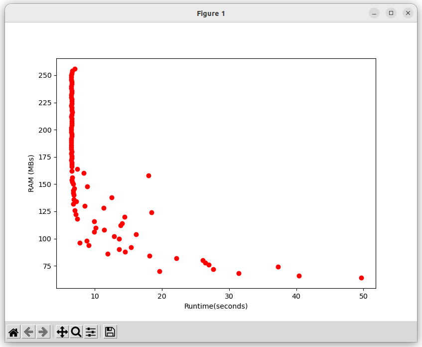
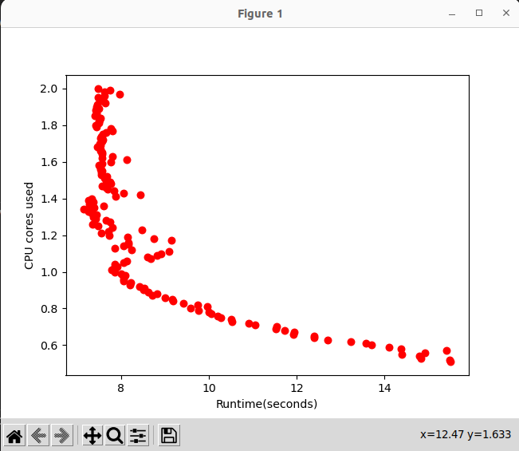

# Edge Benchmarking Framework

## Getting started

This repository is under continuous development, currently being able to run a MLP model inference with around 64MB RAM. 

## First time use

`docker build -t inf_bench:latest .`

Follwed by: `bash docker_monitor.sh & bash seq_memory_limit.sh`

## Description
At the moment, given the image built from the present Dockerfile, the container will run 10 seeded random observations from the SEU evaluation dataset with an MLP model. 

The `seq_memory_limit.sh` shell script recursively runs the container, checks the return value (0 - succesful run, error otherwise), then gradually decreases memory size.

`docker_monitor.sh` runs the `docker stats` command and saves the output, alongside the date and time, in the `inference_benchmark.txt` file.

After the runs are done, the script calls `plot.py` which gives a visual representation of the obtained results. 

## Roadmap
* check function peak memory usage - partly done - plots next
* add CPU benchmarking 
* create shared volume to be used by both inference & train benchmark
* add other model types and compare memory usage results
* add other datasets
* analyze `--memory-swap` option (benefits/drawbacks)

## License
For open source projects, say how it is licensed.

## Project status
Active
Initial memory & CPU test results below

